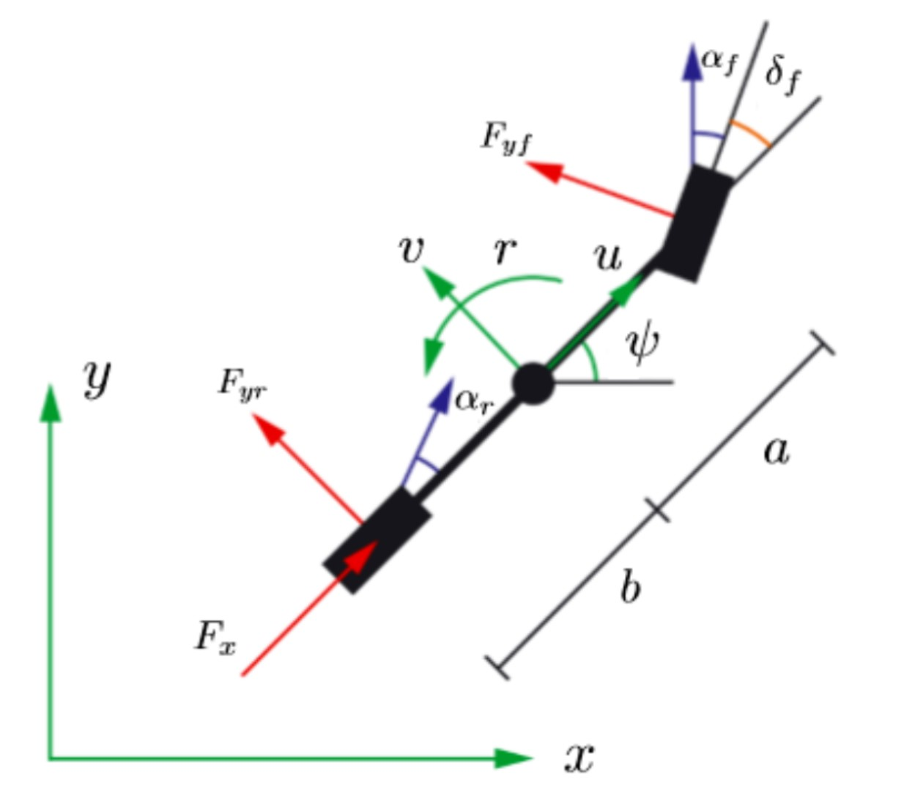
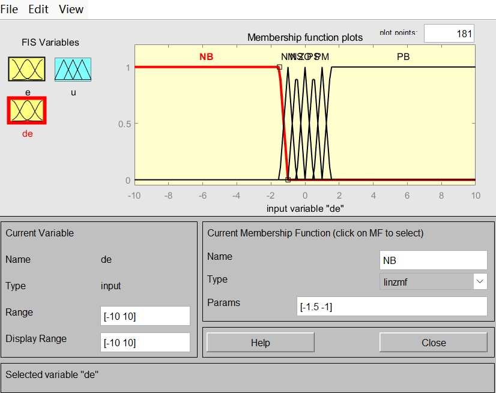
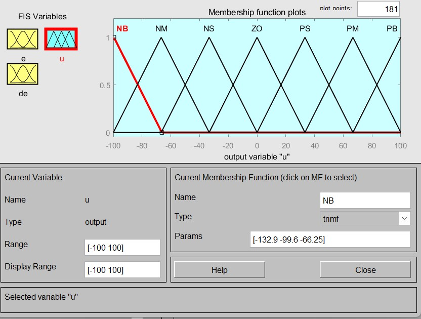
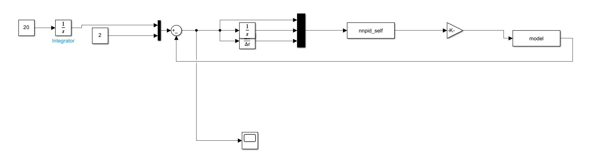
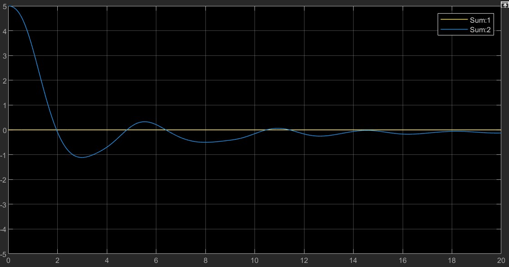

# 无人驾驶汽车紧急换道控制方案

​									 自动化(控制) 石景元 3220103824

## 背景介绍

无人驾驶技术在如今有重要应用。它们有望大幅减少交通事故，提高交通效率，减少拥堵，降低燃油消耗和排放，有助于环境保护。对于老年人和残疾人，无人驾驶汽车提供了更大的移动自由。同时，它们还能改变物流和运输行业，提高效率，降低成本。总之，无人驾驶汽车是未来智能交通和智慧城市的关键组成部分。

在本报告中，我们尝试对无人驾驶汽车进行建模，并给定汽车的目标X和Y，考察模糊控制、模糊PID控制、神经网络PID控制、神经网络自适应控制方案对于无人驾驶汽车的控制效果。

## 系统建模

### 动力学系统建模

考虑将汽车建模为自行车模型，如图所示：



分析得，系统的状态转移方程为:
$$
\begin{align*}
\begin{bmatrix}
\dot{X} \\
\dot{u} \\
\dot{Y} \\
\dot{v} \\
\dot{\psi} \\
\dot{r}
\end{bmatrix}
=
\begin{bmatrix}
u\cos\psi - v\sin\psi \\
\frac{1}{m}(-fmg + N_w F_x - F_{yf}\sin(\delta_f)) + vr \\
u\sin\psi + v\cos\psi \\
\frac{1}{m}(F_{yf}\cos(\delta_f) + F_{yr}) - ur \\
r \\
\frac{1}{I_z}(aF_{yf}\cos(\delta_f) - bF_{yr})
\end{bmatrix}
\end{align*}
$$
系统的状态变量为$X=[X,u,Y,v,\Psi,r]$,系统的控制输入为$U = [F_x,\delta_f]$

我们给定系统的参数如下:

| 参数     | 值    | 描述                         | 参数     | 值   | 描述                         |
| -------- | ----- | ---------------------------- | -------- | ---- | ---------------------------- |
| $N_w$    | 2     | 车辆的重量分布因子           | $f$      | 0.01 | 车辆的前轮分配系数           |
| $I_z$    | 2667  | 车辆的转动惯量               | $a$      | 1.35 | 车辆前后轮之间的距离（前轮） |
| $b$      | 1.45  | 车辆前后轮之间的距离（后轮） | $B_y$    | 0.27 | 侧偏刚度系数                 |
| $C_y$    | 1.2   | 侧偏刚度系数                 | $D_y$    | 0.7  | 侧偏刚度系数                 |
| $E_y$    | -1.6  | 侧偏刚度系数                 | $S_{hy}$ | 0    | 侧偏刚度系数（可能为修正项） |
| $S_{vy}$ | 0     | 侧偏刚度系数（可能为修正项） | $m$      | 1400 | 车辆质量                     |
| $g$      | 9.806 | 重力加速度                   |          |      |                              |

### 系统sfunction

```matlab
function [sys,x0,str,ts,simStateCompliance] = model(t,x,u,flag)
    switch flag
        case 0 % Initialization
            [sys,x0,str,ts,simStateCompliance] = mdlInitializeSizes;
        case 1 % Derivatives
            sys = mdlDerivatives(t,x,u);
        case 3 % Outputs
            sys = mdlOutputs(t,x,u);
        otherwise
            sys = [];
    end
end

%% Initialization Function
function [sys,x0,str,ts,simStateCompliance] = mdlInitializeSizes
    sizes = simsizes;
    sizes.NumContStates  = 6; % 6 states: [X,u,Y,v,phi,r]
    sizes.NumDiscStates  = 0;
    sizes.NumOutputs     = 2; % Outputs: [X,Y]
    sizes.NumInputs      = 2; % Inputs:  [Fx,delta_f]
    sizes.DirFeedthrough = 1; % Direct feedthrough of inputs
    sizes.NumSampleTimes = 1;
    sys = simsizes(sizes); 
    x0  = [0,20,0,0,0,0];% Initial conditions for the states
    str = [];
    ts  = [-1 0]; % Continuous system
    simStateCompliance = 'UnknownSimState';
end

%% Derivatives Function (Quadrotor Dynamics)
function sys = mdlDerivatives(t,x,u)
% given parameters of system
Nw=2; f=0.01; Iz=2667; a=1.35; b=1.45; 
By=0.27; Cy=1.2; Dy=0.7; Ey=-1.6;
Shy=0; Svy=0; m=1400; g=9.806;
F_x = u(1);
delta_f = u(2);

%slip angle functions in degrees
a_f=rad2deg(delta_f-atan2(x(4)+a*x(6),x(2)));
a_r=rad2deg(-atan2((x(4)-b*x(6)),x(2)));
%Nonlinear Tire Dynamics
phi_yf=(1-Ey)*(a_f+Shy)+(Ey/By)*atan(By*(a_f+Shy));
phi_yr=(1-Ey)*(a_r+Shy)+(Ey/By)*atan(By*(a_r+Shy));

F_zf=b/(a+b)*m*g;
F_yf=F_zf*Dy*sin(Cy*atan(By*phi_yf))+Svy;

F_zr=a/(a+b)*m*g;
F_yr=F_zr*Dy*sin(Cy*atan(By*phi_yr))+Svy;

F_total=sqrt((Nw*F_x)^2+(F_yr^2));
F_max=0.7*m*g;
% saturation of input F
if abs(F_total)>F_max
    
    F_x=F_max/abs(F_total)*F_x;
  
    F_yr=F_max/abs(F_total)*F_yr;
end

%vehicle dynamics 
sys= [x(2)*cos(x(5))-x(4)*sin(x(5));...
          (-f*m*g+Nw*F_x-F_yf*sin(delta_f))/m+x(4)*x(6);...
          x(2)*sin(x(5))+x(4)*cos(x(5));...
          (F_yf*cos(delta_f)+F_yr)/m-x(2)*x(6);...
          x(6);...
          (F_yf*a*cos(delta_f)-F_yr*b)/Iz];
end


%% Outputs Function (Quadrotor States)
function sys = mdlOutputs(t,x,u)
    % Return the current states: x,y
    sys = [x(1);x(3)];
    % sys = x;
end
```


## 控制方法分析

我们知道，在汽车紧急换道问题中，汽车需要满足以下要求: **能快速跟踪期望的X输入(加速或者减速)，能快速切换到期望的Y并减少振荡，消除静差**。在换道问题中，$\Psi$通常不太大，我们可以近似认为$F_x$只影响系统的X，而$\delta_f$仅影响系统的Y。

在该问题中，控制输入一般很大$F_x$和$mg$数量级相当,约为$10^4$；$\delta_f$数量级较小,约为$10^{-3}$~$10^{-1}$ ，两者数量级相差较大，尤其是对神经网络控制难度较大，我们考虑两个控制分量采用不同参数的同一控制器，在输入系统时各自乘上与数量级对应的增益，即可完成控制问题。下面我们将介绍针对紧急换道系统的控制方案.

### 模糊控制

#### 控制算法介绍

系统的$X$和$Y$收到不同数量级的两个控制输入$F_x$和$\delta_f$控制，两者虽然存在耦合关系，但是在一般问题中汽车的$\Psi$相对较小，耦合关系可以忽略，我们考虑使用两个相同的模糊控制器来控制着两个控制输入，再输入道系统时各自乘上对应的增益系数。我们设置如下模糊集合

<left class="half">
    
    
    
<left>

如图所示，我们设定系统的输入论域和输出论域分别为$[-10,10]$,$[-10,10]$,$[-100,100]$。我们根据模糊控制的控制规则表建立模糊控制规则库。

| E\EC | NB   | NM   | NS   | ZERO | PS   | PM   | PB   |
| ---- | ---- | ---- | ---- | ---- | ---- | ---- | ---- |
| NB   | NB   | NB   | NB   | NM   | NM   | NS   | ZERO |
| NM   | NB   | NB   | NM   | NM   | NS   | ZERO | PS   |
| NS   | NB   | NB   | NS   | NS   | ZERO | PS   | PM   |
| ZERO | NB   | NM   | NS   | ZERO | PS   | PM   | PB   |
| PS   | NM   | NS   | ZERO | PS   | PS   | PB   | PB   |
| PM   | NS   | ZERO | PS   | PM   | PM   | PB   | PB   |
| PB   | ZERO | PS   | PM   | PM   | PB   | PB   | PB   |

得到模糊控制器的控制曲面如下:


#### simulink模型搭建

在`fuzzy_direct.fis`中实现了系统的模糊控制规则，在`fuzzy_control.slx`中实现了系统的simulink模型.其中我们输入到系统的增益分别为100和0.001。


### 模糊PID控制

#### 控制算法介绍

我们给出模糊PID控制的模糊曲面和模糊规则如下:


根据以上规则表，建立模糊控制规则库（共7*7=49条规则），可视化控制曲面如下：

| Kp控制曲面                            | Ki控制曲面                            | Kd控制曲面                            |
| ------------------------------------- | ------------------------------------- | ------------------------------------- |
|  |  |  |

#### simulink模型构建

在`fuzzyadp.fis`中实现了系统的模糊控制规则，在`fuzzy_adaption.slx`中实现了系统的simulink模型.其中我们输入到系统的[Kp,Ki,Kd]分别相对于原值乘上[800 200 800]和[0.0005 0 0.002]，可以实现对X方向加速减速和Y方向阶跃输入较好的跟踪。


### 神经网络PID控制（BP PID控制）

在进行PID控制的过程中，通过学习算法优化神经网络参数，从而使得输出的Kp，Ki，Kd能由更好的性能。在该神经网络中，我们以误差及其积分微分为神经网络的输入,采用两层神经网络，完成对Kp，Ki，Kd的优化。

在实际操作的过程中，我们发现，如果直接对Kp，Ki，Kd进行优化，Kp，Ki，Kd极容易达到其最大值或者最小值，从而使得比例、积分、微分中的某个环节不起作用或者某个环节作用过大，显著加剧系统的不稳定。为了解决这个问题，**我们对系统的输出的Kp,Ki,Kd加上一个为1的偏置**。我们发现，上述系统的输出变得稳定。**而且当我们增大学习率，系统的性能变好，说明我们的学习算法有效**。

然而即便是这样，我们的神经网络PID控制的稳定性仍然不佳，如果同时调整X和Y的输入使其偏离系统原始状态，系统将变得不稳定。

以下是神经网络PID控制的代码和simulink图，代码在`nnpid_self.m`中，simulink文件在`nnpid.slx`中

#### 代码

**初始化**

```matlab
function [sys, x0, str, ts] = nnpid_self(t, x, u, flag)
    % Neural Network PID Control S-Function
    % Input: u = [x_0, y_0, x_1, y_1, x_2, y_2, bx_0, by_0, bx_1, by_1]
    % Output: [du_x, du_y]

    switch flag
        case 0 % initilize
            [sys, x0, str, ts] = mdlInitializeSizes;
        case 2 % calculate deritive
            sys = mdlUpdate(t, x, u);
        case 3 % calculate output
            sys = mdlOutputs(t, x, u);
        otherwise % other circumstances
            sys = [];
    end
end

%% Initialization
function [sys, x0, str, ts] = mdlInitializeSizes
    global wi wo xite alfa wo_prev wi_prev u1_1;
    u1_1 = [0;0];
    rng('default'); % For reproducibility
    wi = randn(10, 8);  % Input to hidden layer weights (10x8)
    wo = randn(6, 10);  % Hidden to output layer weights (6x10)
    xite = 0.005;  % Learning rate
    alfa =0.0001;  % Momentum term
    wo_prev = wo;  % Previous output layer weights
    wi_prev = wi;  % Previous hidden layer weights
    % Initialize the sizes structure
    sizes = simsizes;
    sizes.NumContStates  = 0;  % No continuous states
    sizes.NumDiscStates = numel(wi) + numel(wo);  % Total number of weights
    sizes.NumOutputs     = 2;  % Outputs: [du_x, du_y]
    sizes.NumInputs      = 6; % Inputs: [e_x, e_y, e_x_1, e_y_1, e_x_2,e_y_2]
    sizes.DirFeedthrough = 1;  % Direct feedthrough (output depends on input)
    sizes.NumSampleTimes = 1;  % Single sample time
    sys = simsizes(sizes);

    % Initialize neural network weights
    x0 = [wi(:); wo(:)];  % Initial weights
    str = [];
    ts  = [0.001 0];  % Sample time: [period, offset]
end
```
**完成对神经网络参数的更新**

```matlab
%% Update discrete states (neural network weights)
function sys = mdlUpdate(~, x, u)
    global wi wo xite alfa wo_prev wi_prev;
    wi = reshape(x(1:80), [10, 8]);  % First 80 elements are wi
    wo = reshape(x(81:140), [6, 10]);  % Next 60 elements are wo

    % Inputs
    p_x = u(1);p_y=u(2); i_x=u(3); i_y=u(4);d_x=u(5);d_y=u(6);

    % Neural network input
    xi = [p_x; i_x ; d_x; 1; p_y;i_y;d_y; 1];  % Include bias term
    % Hidden layer output
    I = wi * xi;  % Hidden layer input
    Oh = max(0, I);  % Hidden layer activation (ReLU)

    % Output layer output
    K = wo * Oh;  % Output layer input
    K = 1 ./ (1 + exp(-K));  % Output layer activation (sigmoid)

    % Error for weight update
    error = [ p_x;i_x; d_x;p_y;i_y;d_y];

    % Output layer gradient
    dK = K .* (1 - K);  % Sigmoid derivative
    delta3 = dK .* error;  % Element-wise product

    % Hidden layer gradient
    dOh = (I > 0);  % ReLU derivative
    delta2 = (wo' * delta3) .* dOh;  % Backpropagate error

    % Weight update
    d_wo = xite * (delta3 * Oh') + alfa * (wo - wo_prev);
    d_wi = xite * (delta2 * xi') + alfa * (wi - wi_prev);

    % Update weights
    wo_prev = wo;
    wi_prev = wi;
    wo = wo - d_wo;
    wi = wi - d_wi;

    % Update discrete states (weights)
    sys = [wi(:); wo(:)];  % Flatten weights into a single vector
end
```
** 计算系统的输出
```matlab
%% Calculate outputs
function sys = mdlOutputs(~, ~, u)
    global wi wo u1_1;  % Neural network weights

    % Inputs
    p_x = u(1);p_y=u(2); i_x=u(3); i_y=u(4);d_x=u(5);d_y=u(6);

    % Neural network input
    xi = [p_x; i_x ; d_x; 1; p_y;i_y;d_y; 1];  % Include bias term
    % Hidden layer output
    I = wi * xi;  % Hidden layer input
    Oh = max(0, I);  % Hidden layer activation (ReLU)

    % Output layer output
    K = wo * Oh;  % Output layer input
    K = 1 ./ (1 + exp(-K));  % Output layer activation (sigmoid)

    % PID parameters
    kp_x = K(1)+1; ki_x = K(2)+1; kd_x = K(3)+1;
    kp_y = K(4)+1; ki_y = K(5)+1; kd_y = K(6)+1;

    % Control outputs  
    u_x = kp_x * p_x + 4*ki_x * i_x +2*kd_x * d_x;
    u_y = kp_y * p_y + 0.1*ki_y * i_y + 0.55*kd_y * d_y;

    % Output
    u1_1(1)=u_x;
    u1_1(2)= u_y;
    sys = u1_1;  % Output is 2-dimensional
end
```

#### simulink文件



### 神经网络自适应控制

#### 算法介绍

我们的系统为二阶系统,我们考虑使用RBF网络逼近位置函数$f$,从而得到函数$\hat{f}$,RBF的输入为$X,\dot{X}$，隐藏层为高斯基函数，输出为$\hat{f}(x)$。RBF的表达式为$h_j = exp(-\frac{\norm{x-c_j}^2}{2b_j^2})$,$\hat{f} = \hat{W}^Th(x)$。我们定义滑膜面$s = c_ee+\dot{e}$。

我们可以给出控制律

$$
u = K(-\hat{f}(x,\dot{x})-s-eta*sign(s))
$$

自适应控制律为
$$
\dot{\hat{W}} = \gamma_s h(x)
$$

#### 代码实现

**初始化**

```matlab
function [sys,x0,str,ts,simStateCompliance] = nnadaptive_self(t,x,u,flag)
    switch flag
        case 0, % initialization
            [sys,x0,str,ts,simStateCompliance] = mdlInitializeSizes;
        case 1, % calculate deritive
            sys = mdlDerivatives(t,x,u);
        case 3, % calculate output
            sys = mdlOutputs(t,x,u);
        otherwise % other circumstances
            sys = [];
    end
end

% initialization
function [sys,x0,str,ts,simStateCompliance]=mdlInitializeSizes
    sizes = simsizes;
    sizes.NumContStates = 10; % neural network hidden size
    sizes.NumDiscStates = 0;
    sizes.NumOutputs = 2; % ouput[F_x,delta_f]
    sizes.NumInputs = 8; % input [Xref,Yref,dXref,dYref,X,Y,dX,dY]
    sizes.DirFeedthrough = 1;
    sizes.NumSampleTimes = 1;
    sys = simsizes(sizes);

    % initialize params
    global b c c_X c_Y d
    x0 = 0.1*ones(1,10); % initial weights
    c = 0.5*randn(4,10); % randomly initialize centers
    b = 10.0; % innitialize b
    c_X = 1; % Synovial control param
    c_Y = 0.5;
    d = 0.00001;% initial control param

    str = [];
    ts = [-1 0];
    simStateCompliance = 'UnknownSimState';
end

```

**自适应控制律**

```matlab
% deritive
function sys=mdlDerivatives(t,x,u)
    global b c c_X c_Y d
    % goal
    X_g = u(1); 
    Y_g = u(2); 
    dX_g = u(3); 
    dY_g = u(4); 

    % raal state
    X = u(5);
    Y = u(6);
    dX = u(7);
    dY = u(8);

    % calculate difference
    e_X = X - X_g;
    e_Y = Y - Y_g;
    de_X = dX - dX_g;
    de_Y = dY - dY_g;

    % Synovial control variable
    s_X = c_X*e_X + de_X;
    s_Y = c_Y*e_Y + 1*de_Y;

    W = x(1:10); % initial weights of NN network
    xi = [X; Y; dX; dY]; % state vector

    % RBF output
    h = zeros(10,1);
    for j = 1:10
        h(j) = d * exp(-norm(xi-c(:,j))^2/(2*b^2));
    end

    % adaptive control
    gama = 1000;
    for i = 1:10
        sys(i) = gama*(s_X*h(i) + s_Y*h(i)); % update weights
    end
end
```

**控制律**

```matlab
% output
function sys=mdlOutputs(t,x,u)
    global b c c_X c_Y d
    % goal
    X_g = u(1); 
    Y_g = u(2);
    dX_g = u(3); 
    dY_g = u(4); 

    % real state
    X = u(5);
    Y = u(6);
    dX = u(7);
    dY = u(8);

    % calculate error
    e_X = X - X_g;
    e_Y = Y - Y_g;
    de_X = dX - dX_g;
    de_Y = dY - dY_g;

    % Synovial control variable
    s_X = c_X*e_X + de_X;
    s_Y = c_Y*e_Y + de_Y;

    % RBF output
    W = x(1:10); % NN weights
    xi = [X; Y; dX; dY]; % state vector
    h = zeros(10,1);
    for j = 1:10
        h(j) = d * exp(-norm(xi-c(:,j))^2/(2*b^2));
    end

    % adaptive control
    fn = W'*h; % output of NN network
    eta_X = 2.0; % stability factor
    eta_Y = 0.1;
    ut_X = -s_X - fn - eta_X * sign(s_X); % ux
    ut_Y = -s_Y - fn - eta_Y * sign(s_X) ; % uy
    
    % output
    sys =[1000*ut_X; 0.6*ut_Y]; 
    end
```

#### simulink文件


## 控制算法性能分析

我们考虑现实中的场景，假如车辆正在以20m/s的速度行驶，前方车辆突然减速，车辆需紧急减速并避让。或者后方车辆速度过高，车辆需要紧急加速并避让。下面我们将逐个对模糊控制、模糊PID控制、神经网络PID控制、神经网络自适应控制进行分析。

### 模糊控制

#### 紧急加减速变道性能分析

以下是两种不同情况的误差曲线，分别对应汽车加速变道和减速变道，其中黄线代表X，蓝线代表Y,汽车初始速度为20m/s. 后续相关设定与本题类似，不再赘述. 

| X方向给定为25t(m),Y方向上变道5m               | X方向给定为15t(m),Y方向上变道5m                   |
| --------------------------------------------- | ------------------------------------------------- |
|  |  |

可以看出，系统的响应性能和一阶系统类似，**X分量由于汽车速度和给定速度不同,一开始偏差增加，随后随着控制的作用而减少**。加速变道大约用时5s,减速变道大约用时14s. 系统振荡小，响应速度适中，比较稳定。

#### 系统跟踪性能分析

尽管我们考察的场景是系统紧急加减速变道，但是我们仍然想要考察以下系统的跟踪性能，

考虑系统本来以20m/s的速度前行，Y方向给定的函数为$Y=4sin(0.2t)$

| X方向给定为25t(m)                                   | X方向给定为15t(m)                                       |
| --------------------------------------------------- | ------------------------------------------------------- |
|  |  |

系统对于变化缓慢的系统跟踪性能尚且可以接受，但是对于变化较大的系统跟踪性能几乎无法符合要求。如果需要跟踪$Y=4sin(0.5t)$​，则需要更改系统的参数，调节输入模糊规则的增益为3和20，调节输出增益为0.008. 但是通过实验发现，该系统仅仅适用于减速正弦跟踪，而且最后会存在一定精差。如果X方向加速，Y方向采用正弦跟踪，系统即会发散。修改参数后，对于Y方向的阶跃响应，响应速度过慢，因此事实上这种系统无法兼顾正弦跟踪和阶跃输入，系统稳定性较差。

| X方向减速                                                    | X方向加速                                                   |
| ------------------------------------------------------------ | ----------------------------------------------------------- |
|  |  |

总而言之，在上述实验中，模糊控制对于相对较为简单的紧急加减速变道有相对较好的特性，但是对于正弦跟踪效果不佳，这一方面是因为变道假设得到的控制输入的解耦，另一方面是因为模糊控制的性能有限。

### 模糊PID控制

#### 紧急加减速变道性能分析

| 加速变道                                   | 减速变道                                       |
| ------------------------------------------ | ---------------------------------------------- |
|  |  |

可以看出，加速减速变道均大约用时20s. 系统存在一定超调，响应速度相对较慢，但比较稳定。

#### 系统跟踪性能分析

我们考虑输入为$Y=4sin(0.5t)$，

| X减速Y正弦                                                   | X加速Y正弦                                             |
| ------------------------------------------------------------ | ------------------------------------------------------ |
|  |  |

系统对于变化较大的系统跟踪性能几乎无法符合要求。如果需要跟踪$Y=4sin(0.5t)$，则需要更改系统的参数，调节输入Y分量的增益为[0.005 0.005 0.1]. 但是通过实验发现，该系统仅仅适用于减速正弦跟踪，X方向加速, 系统即会发散。且与模糊控制相比，系统的动态性能不好。

在上述实验中，模糊PID控制对于相对较为简单的紧急加减速变道有相对可以接受的特性，但是与模糊控制系统相比不佳。对于正弦跟踪效果更加不如模糊控制。

### 神经网络PID控制

使用神经网络控制时我们发现，系统很容易发散。经过分析，认为原因如下:

> 系统本身非常不稳定，如果一开始参数初始化的不好，且后期偏差较大的采样较多，系统的参数容易收敛(因为更新值较大，由于K使用了sigmoid激活函数，最后K会变为0或1，导致最后比例积分微分中的一项或几项不起作用，更加加剧了这个问题。
>
> 另一方面，X，Y对应的控制输入的Kp,Ki,Kd在同一个神经网络中处理，一般只使用两层神经网络完成，但如果同时输入X，Y的偏差，两者会造成干扰。尤其是该问题中X，Y对应的K的数量级差别很大，容易造成输出的偏差。

为此，我们选择对最后的K值再加一个1，虽然这个做法改善了系统的稳定性，但是很遗憾，神经网络PID控制在该系统中的效果并不好，系统不稳定，只能单独完成加减速和单独完成变道。在这个任务中，我们设置学习率xite为0.05， 冲量系数为0.01.

**加减速结果**

| 单独加速                           | 单独减速                               |
| ---------------------------------- | -------------------------------------- |
|  |  |

**变道结果**

| 给定Y=2                        | 给定Y=5                        |
| ------------------------------ | ------------------------------ |
|  |  |

可以看到，即便在单独加速和单独减速的控制中，或是在单独变道系统控制中，系统仍然有很强的振荡，基于神经网络PID控制的控制器对于这个复杂系统很难完成控制任务。

我们通过更改xite和alfa值到0来验证学习算法的有效性，在给定Y=5时，有

| 学习                           | 不学习                                               |
| ------------------------------ | ---------------------------------------------------- |
|  |  |

可以看出，学习算法的存在减少了系统的超调，但是加剧了系统的不稳定性，这可能和小批量梯度下降的不稳定性有关。当我们处理这个复杂的非线性系统时，K的变化导致的不稳定性可能给我们带来麻烦。

### 自适应PID控制

#### 紧急加减速变道性能分析

| 加速变道                                    | 减速变道                                        |
| ------------------------------------------- | ----------------------------------------------- |
|  |  |

加减变道响应时间在10s左右，性能和模糊控制相近，且系统没有振荡和超调，非常稳定，比较适合作为控制系统。

#### 系统跟踪特性

我们取$Y=4sin(0.5t)$，考虑X方向加速或减速

| 加速跟踪                                                  | 减速跟踪                                                     |
| --------------------------------------------------------- | ------------------------------------------------------------ |
|  |  |

可以看出，我们没有改变系统参数，但是系统在10s内误差均收敛到0，说明系统对于较快的正弦函数仍然有较好的跟踪效应，该控制方法能够很好的跟踪Y方向的正弦输入和Y方向的阶跃输入，同时完成X方向的加速和减速。

## 总结

**控制方法对于系统而言没有永远最适合的**，在该系统中，性能是神经网络自适应控制>模糊控制>模糊PID控制>神经网络PID控制。神经网络自适应控制无需修改系统参数即可进行紧急变道加减速和正弦信号跟踪加减速；模糊控制和模糊PID控制虽然能够实现相对比较好的紧急变道加减速控制，但是对于正弦跟踪需要修改参数，而且最后的效果不佳。神经网络PID控制只能实现加减速控制或者变道控制，不能两者同时进行。这些是由控制算法的特性决定的，对于不同系统各有适配的算法。

在该问题中，控制的难点是控制输入的耦合和数量级不同。在实际实验过程中，进行PID调节保证系统稳定性是很困难的。四种控制方法中，经过参数调节，除神经网络PID控制外，能够保证这一点。而**只有神经网络自适应控制能够在参数不变的情况下同时兼顾系统的Y方向正弦跟踪、阶跃输入，并兼顾X方向的加速和减速**。从效果来看，神经网络自适应控制对于这个问题给出了很好的解决效果。


