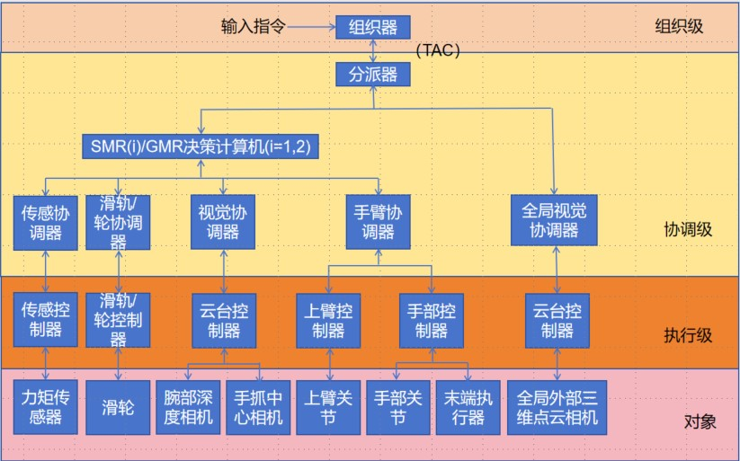
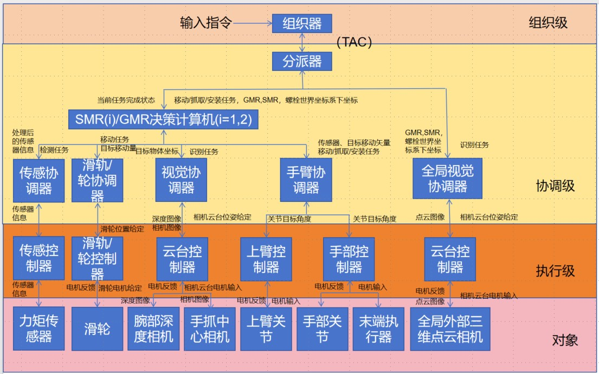

# 多机器人协作系统递阶控制结构
​									自动化(控制) 石景元 3220103824

## 分级递阶控制系统概述

分级递阶控制系统分为三个层级，分别是组织级、协调级、执行级，三者遵循自上而下“精度 递增伴随智能递减” 的IPDI原则。`组织级`位于智能控制系统的最上面一层，通过人机接口和用户进行交互，涉及知识的表示与处理 ，执行最高决策的控制功能， 监视并指导协调级和执行级的所有行为，命令输入机器推理，智能程度最高。 对于给定的外部命令和任务，组织级设法找到能够完成该任务的子任务（或动作） 组合。将这些子任务要求送到协调级，通过协调处理，将具体的动作要求送至执 行级完成所要求的任务。对任务执行的结果进行性能评价，并将评价结果逐级向上反馈，同时对以前存储的知识信息加以修改，从而起到学习的作用。`协调级`分为分派器和协调器，分派器基于其下层提供的信息，通过设计和计划，决定如何完成组织级下达的指令或任务 ，并由此产生下一层所能识别的控制指令。协调器主要通过自适应整定和调度完成上层 指派的控制任务，并给执行级提供适当的算法或算法序列。`执行级`运行控制级，直接控制局部过程并完成子任务；可采用常规的优化控制，智能程度最低，控制精度最高。

## 多机器人协作系统递阶控制系统

图示为多机器人协作系统递阶控制系统，其中对于上臂关节，SMR为关节1-4，GMR为关节1-3；对于手部关节，SMR为关节5-7,GMR为关节4-6。现分阶段阐述该系统如何实现`从无序堆放的工件中拾取目标螺杆，并将螺杆的两端装上合适的螺帽，然后放置在期望目标位置`的任务。

## 各层次具体功能

### 组织层

接收外部指令和全局视觉协调器返回的识别到的信息，根据决策计算机返回的状态，决定当前执行的关于时序的子任务，并将要分派的任务给到任务分派器。（其中给到各个机器人决策计算机的包含螺栓位置在GMR，SMR在GMR，SMR坐标系下的坐标，该坐标通过算法得到）

组织层中的时序子任务为：GMR机械臂抓取螺杆并移动到指定位置、SMR机械臂为螺杆两端安装螺栓、GMR将螺杆移到指定位置

### 协调层

* **分派器**：根据组织层给到的任务，将子任务分派到各个决策计算机和协调层。

* **全局视觉协调层**：根据相机返回的信息，分派器的分派任务和内置的识别算法，识别到GMR，SMR，螺栓的位置，并通过内置算法计算出其在世界坐标系下的位置。

* **机器人决策计算机**：根据当前分派器分派的任务(包含目标位置)、传感和视觉协调器返回的信息，规划在未来一小段时间内机械臂末端、相机、滑轮、相机云台的目标移动量。决策计算机根据收到的分派器中的任务和从协调层中得到的状态，确定当前所处的时序子任务，向下一级的协调器发送。具体的时序子任务如下：

  | 组织层时序子任务                  | 对应决策计算机 | 决策计算机时序子任务                                    |
  | --------------------------------- | -------------- | ------------------------------------------------------- |
  | GMR机械臂抓取螺杆并移动到指定位置 | GMR            | 大范围位置对齐，小范围位置对齐，抓取，移动螺栓          |
  | SMR机械臂为螺杆两端安装螺栓       | SMR1，SMR2     | 大范围位置对齐，小范围位置对齐，安装螺栓，SMR机械臂移开 |
  | GMR将螺杆移到指定位置             | GMR            | 大范围位置对齐，小范围位置对齐，放置螺栓，GMR机械臂移开 |

  机器人决策计算机根据当前的时序任务，将子任务分派给以下协调器：

  * **传感协调器**： 根据分派的任务和传感器返回的信息，处理来自力矩传感器的检测信息。
  * **视觉协调器**： 根据分派的任务和相机返回的信息，利用内置的识别算法，识别目标的位置，利用内置算法计算其相对于机器人坐标系的位置。其中使用深度相机的信息完成三维空间追踪目标物体，使用中心相机完成物体的识别及位置矫正。
  * **滑轮/轨协调器**： 根据分派的任务(包含移动的目标位置)完成规划，选择合适的电机增益，确定各个滑轮当前的移动目标位置
  * **手臂协调器**：  依据结束点和上臂关节运动所需要的信息（如快、慢等）来选择合适的增益，确定抓握物体时末端执行器的定向以及在定向过程中腕关节运动的协调。

### 控制层

* **传感控制器**：处理传感器信息，为控制提供依据。
* **滑轨控制器**：接收来自协调器的给定目标，根据协调器的给定位置，通过PID算法给出输入到电机的量
* **云台控制器**(如果有)：控制相机运动，以便更好的定位和识别到物体
* **上臂控制器**：根据协调器信息使用一个次最优的控制器用于控制手臂上部关节运动的控制和协调，将手臂从工作空间的初始位置移到一个预定的终止位置。
* **手部控制器**：控制手臂下部的三个关节和末端执行器，根据物体的状况完成抓握和安装螺帽。

## 信息流动的情况

总体而言，信息的流动符合以下规律：

具体而言，可以采用以下方法描述:

图中，箭头两侧或者一侧标注的文字为信息流的内容，其中所有箭头右侧为自上而下的信息，箭头左侧为自下而上的信息。

## 具体实现步骤

### 阶段一： GMR机械臂抓取螺杆并移动到指定位置

* 组织级根据全局视觉协调器返回的螺杆的世界坐标和决策计算机返回的状态，向GMR决策计算机发出指令，让其移动到对应坐标并抓取。
* GMR决策计算机分四步完成：大范围位置对齐，小范围位置对齐，抓取，移动螺栓。在每个步骤中，SMR决策计算机根据内置规划算法和传感协调器、视觉协调器返回的状态，规划滑轮、机械臂、传感器、相机的关于时间的目标状态(实时修正)，并将任务分配到各个协调级。
* 传感协调级处理来自传感器的检测信息，视觉协调器处理来自相机的信息，滑轮协调器负责规划滑轮运动状态，下发到滑轮控制器以控制滑轮运动。机械臂协调器通过算法规划机械臂关节角，下发到控制器控制机械臂的运动。GMR移动到目标位置，机械臂移动到目标姿态，抓取螺栓，机械臂移动到另一个目标姿态，方便安装螺栓。
* 任务完成后，GMR决策计算机返回信号。

### 阶段二： SMR机械臂为螺杆两端安装螺栓

* 组织级根据全局视觉协调器返回的螺杆的世界坐标和决策计算机返回的状态，向SMR决策计算机发出指令，让其到目标位置旋转螺帽。
* SMR决策计算机分四步完成：大范围位置对齐（SMR相机识别到螺栓），小范围位置对齐（螺栓在SMR相机中的位置符合期望），安装螺栓，SMR机械臂移开。在每个步骤中，SMR决策计算机根据内置规划算法和传感协调器、视觉协调器返回的状态，规划滑轮、机械臂、传感器、相机的关于时间的目标状态，并将任务分配到各个协调级。
* 传感协调级处理来自传感器的检测信息，视觉协调器处理来自相机的信息，滑轮协调器负责规划滑轮运动状态，下发到滑轮控制器以控制滑轮运动。机械臂协调器通过算法规划机械臂关节角，下发到控制器控制机械臂和末端执行器的运动。SMR移动到目标位置，机械臂移动到目标位姿，末端执行器完成安装螺栓任务。

* 当完成任务时，SMR返回信号。当两台SMR都返回信号时，任务终止。

### 阶段三：GMR将螺杆移到指定位置

* 组织级根据全局视觉协调器返回的螺杆的世界坐标和决策计算机返回的状态，向GMR决策计算机发出指令，让其将螺栓移动到指定位置。
* GMR决策计算机分四步完成：大范围位置对齐（GMR相机识别到目标位置标记），小范围位置对齐（目标位置标记在GMR相机中的位置符合期望），放置螺栓，GMR机械臂移开。GMR决策计算机根据内置规划算法和传感协调器、视觉协调器返回的状态，规划滑轮、机械臂、传感器、相机的关于时间的目标状态，并将任务分配到各个协调级。
* 传感协调级处理来自传感器的检测信息，视觉协调器处理来自相机的信息，滑轮协调器负责规划滑轮运动状态，下发到滑轮控制器以控制滑轮运动；机械臂协调器通过算法规划机械臂关节角，下发到控制器控制机械臂和末端执行器的运动。GMR移动到指定位置，机械臂运动到目标姿态，松开末端夹爪。

* 当完成任务时，GMR返回信号，任务终止。

## 多机器人协作系统递阶控制结构的优势

### 层次分明，功能明确

递阶控制结构按 IPDI 原则分为组织级、协调级和执行级，这种层级划分具有显著优势。组织级作为最高智能层级，能依据用户指令和复杂任务情境，将任务合理拆解为子任务，它是系统的 “大脑”，指导整个流程。协调级如同 “神经中枢”，连接上下层，通过分派器和协调器对组织级指令进一步细化，生成可执行的控制指令和算法序列。执行级则是 “执行部队”，虽智能程度低，但以高精度控制完成子任务，保障操作准确性。这种清晰架构让每个层级专注自身功能，避免功能混淆，提高了系统运行效率。

### 高效协作保障

在处理如拾取螺杆、安装螺帽等复杂任务时，各层级紧密协作。组织级发出任务指令启动流程，协调级依据各种传感器和视觉信息规划具体行动，如 GMR 和 SMR 机械臂的动作规划，包括滑轮运动、机械臂关节角度调整等。执行级精确执行这些规划，确保每个动作准确无误。这种高效协作模式极大提高了任务完成度，充分发挥多机器人协作的优势，实现复杂任务的顺利完成。

### 灵活适应特性

- **任务多样性适应**：不同任务对机器人协作有不同要求，无论是处理不同形状工件还是多样化装配任务，递阶控制结构都能应对。组织级可根据任务性质灵活调整子任务分配和指令下达，协调级和执行级相应改变规划和执行方式，确保系统始终能适应任务变化。
- **环境变化适应**：工作环境复杂多变，如光照条件改变、物体遮挡等会影响任务执行。在这种情况下，系统展现出强大适应性。例如，全局视觉协调器能在图像受光线或遮挡影响时，快速调整目标识别算法，重新确定螺杆位置，各层级随之更新运动规划和控制策略，保障任务不受干扰。

