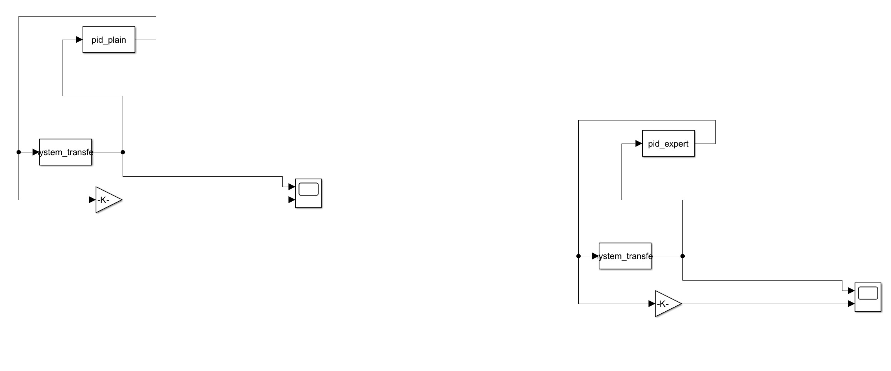
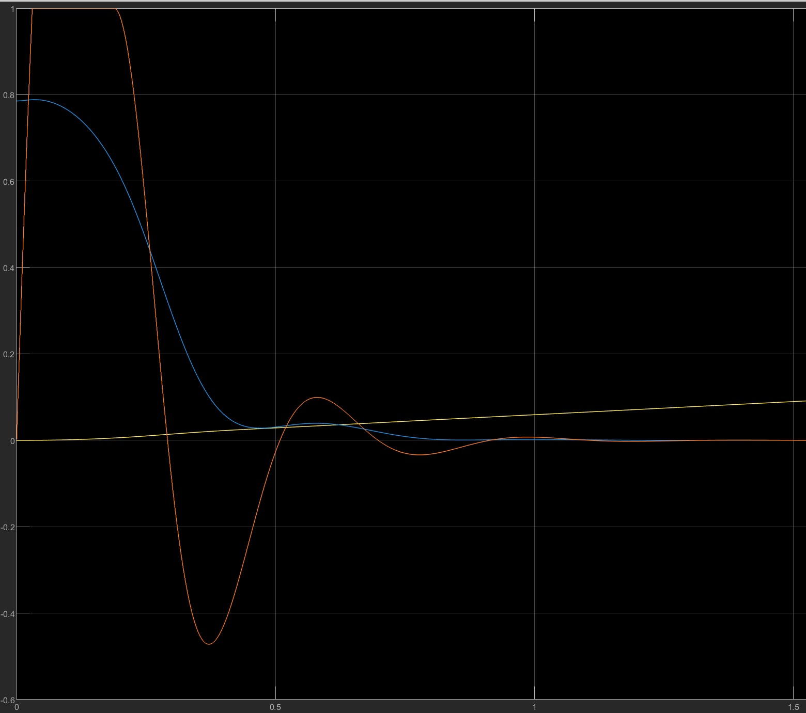
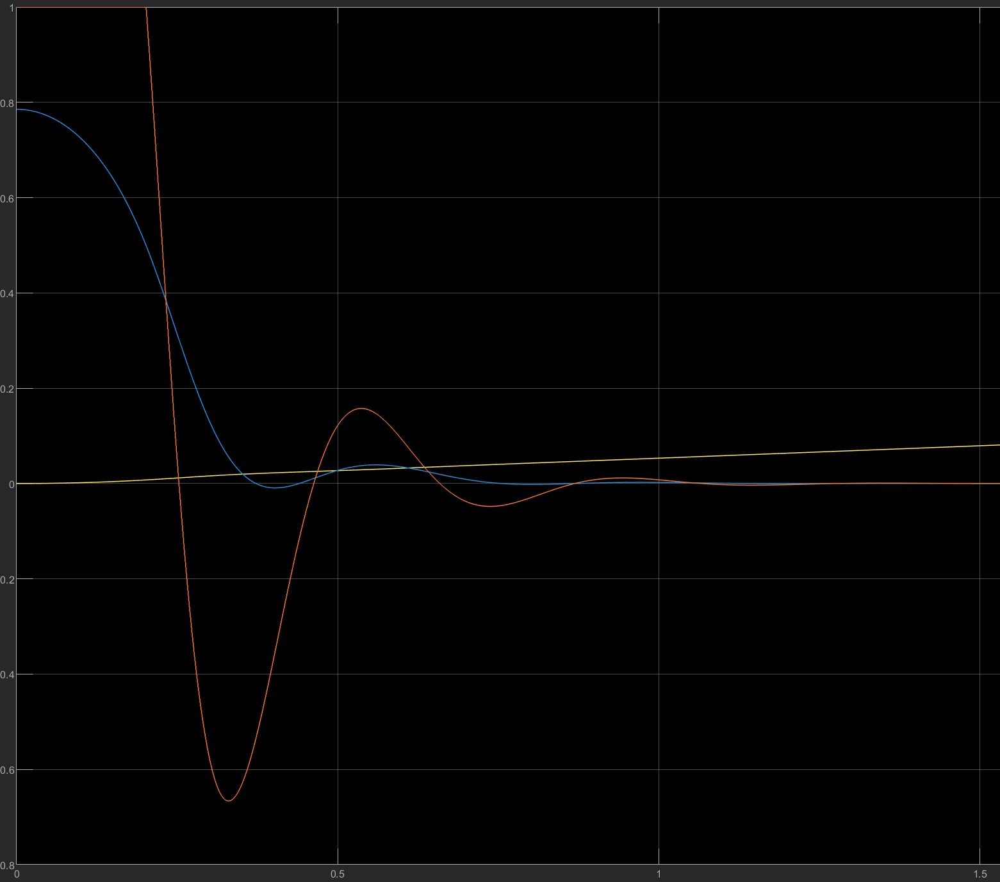
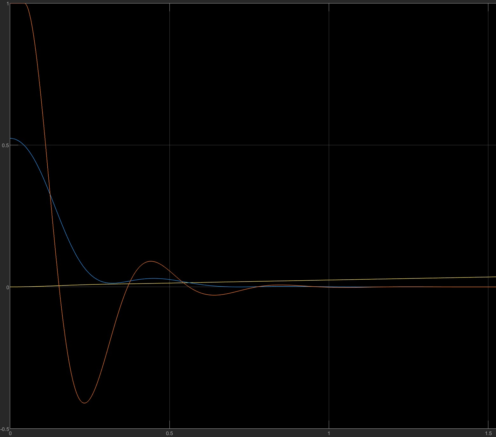
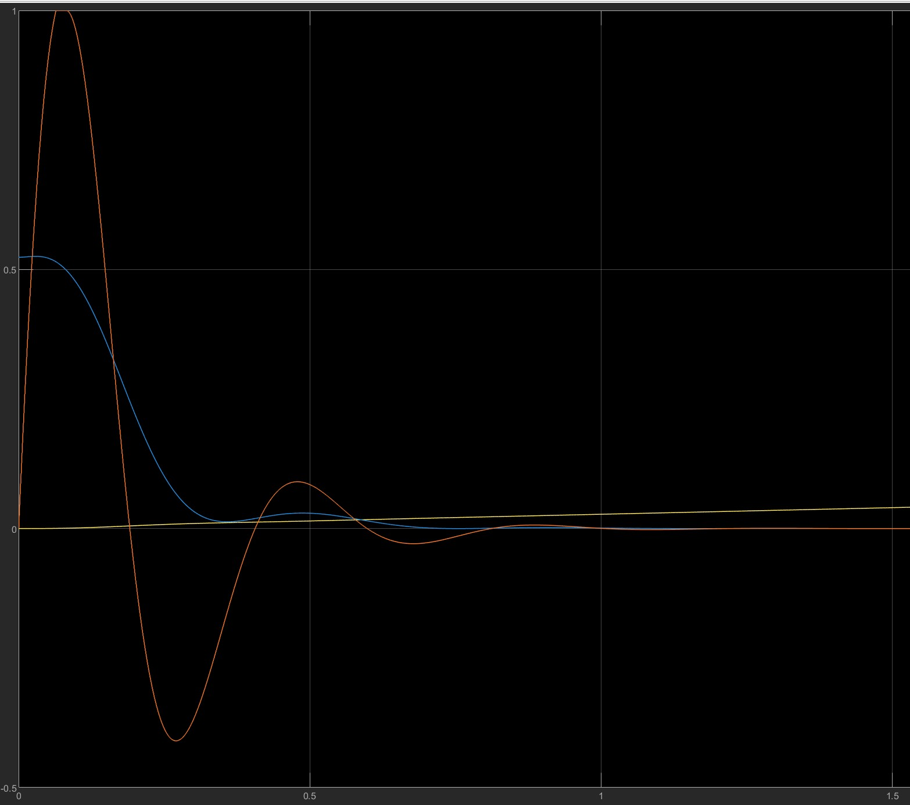
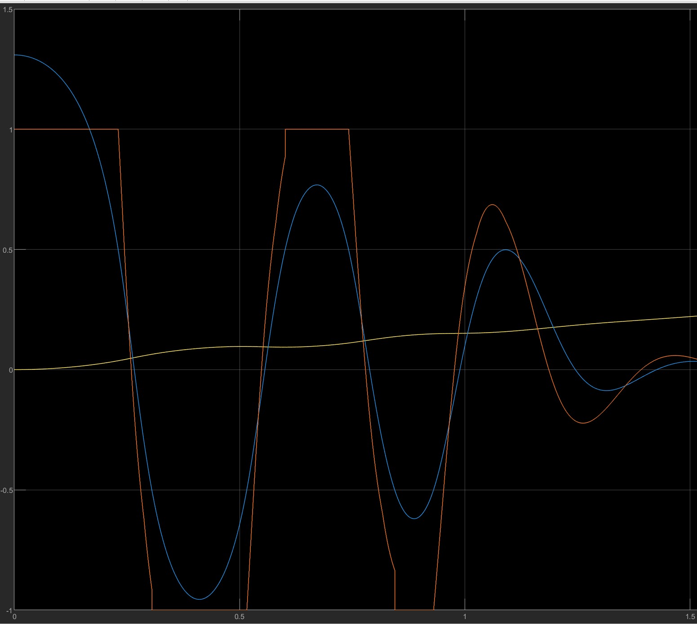
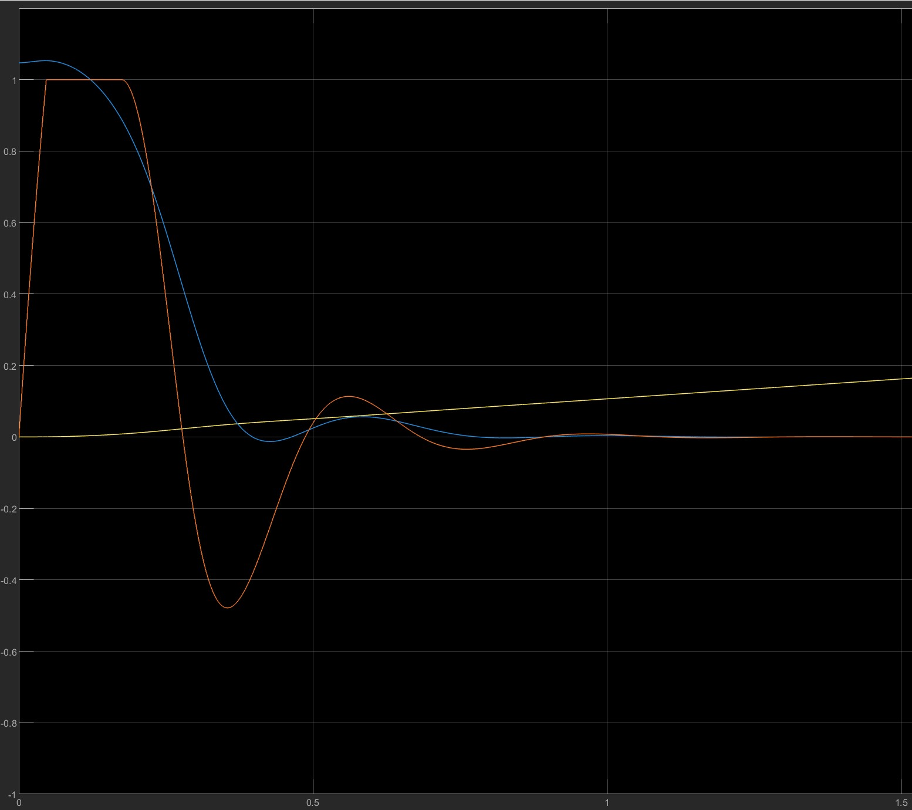
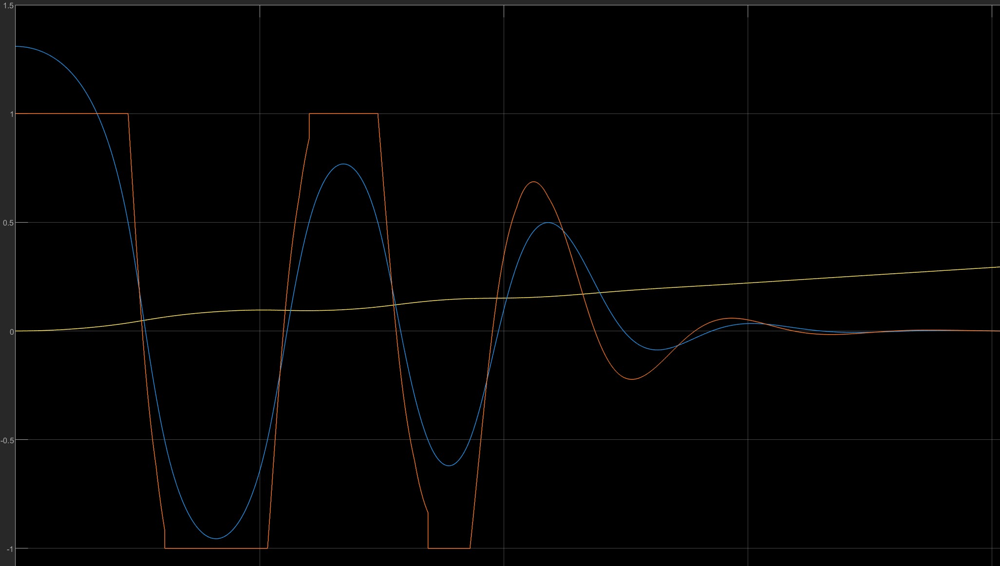
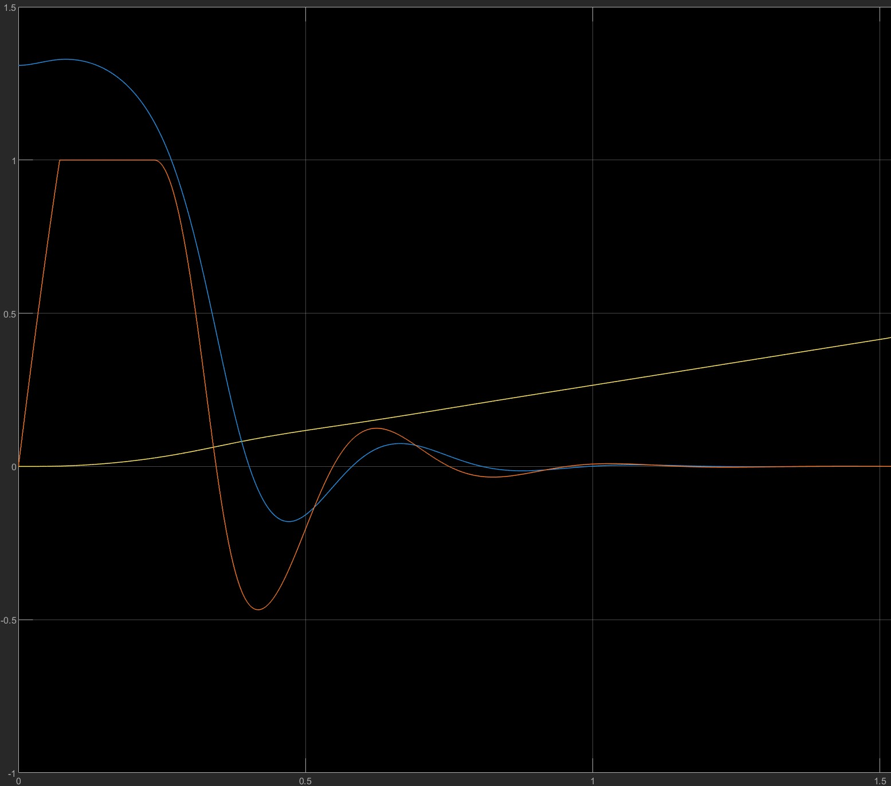

# 			车载倒立摆系统控制

​							                 石景元 自动化(控制)

​						         `友情提示`: 为了批改方便，请先阅读README

## 实验目的

1. 探索车载倒立摆系统的动力学特性，理解如何通过外力 $F$ 控制小车和摆杆的运动状态。
2. 设计并实现基于专家控制的增量型离散PID控制器，验证其对倒立摆系统的稳定性和性能的改善。
3. 比较专家PID控制与常规PID控制的效果，通过仿真实现系统响应曲线的分析。

## 实验原理

### 系统动力学方程

车载倒立摆系统的动力学方程如下：

$$
\begin{cases}
(M+m)\ddot{x} + ml\ddot{\theta} \cos\theta - ml(\dot{\theta})^2 \sin\theta = F \\
ml^2\ddot{\theta} + ml \ddot{x} \cos\theta - mgl \sin\theta = 0
\end{cases}
$$
求解得:
$$
\begin{cases}
\mathop{x}\limits^{..} =  \frac{F + ml {\mathop{\theta}\limits^{.}}^2 \sin{\theta} - m  g  \sin{\theta}\cos{\theta}} {M + m - m  {\cos^2{\theta}}}; \\
 \mathop{\theta}\limits^{..}=\frac{(M+m)g\sin{\theta} -\cos{\theta}(F+ml{\mathop{\theta}\limits^{.}}^2\sin{\theta})  }{(M+m)l-ml\cos^2{\theta}}

\end{cases}
$$

取状态变量为$X=[x, \mathop{x}\limits^{.}, \theta,\mathop{\theta}\limits^{.}]^T$​，取$U=F$可以得到系统的`mdlDerivatives`表达式，从而通过S-function得到系统的方程.
$$
\begin{cases}
\mathop{x}\limits^{.}(1) =x(2) \\
\mathop{x}\limits^{.}(2) = \frac{ U+mlx^2(4)\sin{x(3)} -mg\sin{x(3)}cos{x(3)}} {M + m - m  {\cos^2{x(3)}}}\\
\mathop{x}\limits^{.}(3) =x(4) \\
\mathop{x}\limits^{.}(4) = \frac{(M+m)g\sin{x(3)}-\cos{x(3)}(U+mlx^2(4)\sin{x(3)})}{(M+m)l - ml\cos^2{x(3)}}
\end{cases}
$$

取系统输出为$Y = [x,\theta]$,在实现过程中取$x/50$以便于显示

### 控制算法

* **PID控制**：离散增量型PID控制公式为：$F(k) = F(k-1) + K \left[ K_p \Delta \theta(k) + \frac{T}{T_i} \theta(k) + \frac{T_d}{T} (\Delta \theta(k) - \Delta \theta(k-1)) \right]$
  其中$T$为采样时间，$\Delta\theta(k) = \theta(k) - \theta(k-1)$​
* **专家PID控制**: 专家PID控制根据给定的规则调整PID控制的参数，在题设中，根据摆杆夹角$\theta(k)$ 的范围和变化趋势，动态调整PID增益
> **专家控制规则分析**：
>
> * 当$\theta$超过$\theta_m$时，将F设置为最大，防止系统不稳定，使系统更快收敛
> * 当$\theta$超过$\theta_2$时，若系统发散，则增大K加快收敛，若系统正在收敛且刚由发散进入收敛，则系统仍不够稳定，增大K，否则K=1
> * 当$\theta$超过$\theta_1$时，若系统刚进入收敛状态，若系统稳定收敛，则设置$K=K_s$ （猜测$K_s$较小以减小振荡，但是实验中取$K_s=1$), 否则取K=1
> 
> **具体的控制规则**
> 
> (1) 若 $|\theta(k)| \geq \theta_m$ 时，则 $F(k) = \text{sgn}(\theta) F_m$  
>
> (2) 若 $\theta_2 \leq |\theta(k)| < \theta_m$ 时，
>
> 1. 若 $\theta(k) \Delta\theta(k) > 0$ 时，则 $K = K_b$
>
> 2. 若 $\theta(k) \Delta\theta(k) < 0$ 时，
>
>    a) 若 $\Delta\theta(k) \Delta\theta(k-1) > 0$ 时，则 $K = 1$
>
>    b) 若 $\Delta\theta(k) \Delta\theta(k-1) < 0$ 时，则 $K = K_b$
>
> (3) 若 $\theta_1 \leq |\theta(k)| < \theta_2$ 时，
>
> 1. 若 $\theta(k) \Delta\theta(k) > 0$ 时，则 $K = 1$
>
> 2. 若 $\theta(k) \Delta\theta(k) < 0$ 时，
>
>    a) 若 $\Delta\theta(k) \Delta\theta(k-1) > 0$ 时，则 $K = K_s$
>
>    b) 若 $\Delta\theta(k) \Delta\theta(k-1) < 0$ 时，则 $K = 1$
>
> (4) 若 $|\theta(k)| < \theta_1$ 时，则 $K = 1$​
>
* **实现细节**: 上述系统均为离散系统，更新通过`mdlUpdate`函数的直接赋值更新实现，其中系统状态变量$X = [F(k-1),\theta(k-2),\theta(k-1)]$,一步更新为$[F(k),\theta(k-1),\theta(k)]$,并输出$F(k)$.
### 实验设置

* **系统参数**：根据题设条件，系统参数如下:

| 参数            | 值     | 参数 | 值 |
| --------------- | ------ |------ |------ |
| 摆杆质量 m     | 0.5 kg | 摆杆夹角 $\theta$ | $[0,\pi] rad$ |
| 小车质量 M     | 1.0 kg | 重力加速度g | $9.8m/s^2$ |
| 摆杆质心长度 l | 0.5 m  | 小车受水平外力F   | $[-F_m,F_m]N$ |
* **初始条件**: 选择初始角度$\theta (0) = \pi /4 $​进行验证，随后尝试其它角度
* **文件组织**:
  * `all_in_one.slx`: 显示PID控制和专家PID控制的$\theta,x,F$​曲线
  * `system_transfer.m`: 系统的转移特性,状态变量为$\theta , x$，更新方式为数值积分更新
  * `pid_plain.m` `pid_expert.m`: 增量式PID/增量式专家PID控制器,  状态变量为$F(k), \theta(k-1), \theta(k-2)$，更新方式为离散更新
  * `get_theta.m` `get_F.m` `get_system_param.m`: 设置并得到一系列参数，默认初始参数为第一问的参数

## 代码关键部分展示

### System Transfer

```matlab
% calculate derivatives
function sys = mdlDerivatives(t,x,u)
% set system params
M = 1; m = 0.5; l = 0.5; g = 9.8;
theta = x(3);
theta_dot = x(4);
F = u(1); % input F
% transfer functions
dx1 = x(2); % dx/dt
dx2 = (F + m * l * theta_dot^2 * sin(theta) - m * g * sin(theta)*cos(theta)) / (M + m - m * cos(theta)^2); % d^2x/dt^2 
dx3 = x(4); % dθ/dt
dx4 = ( (M+m)*g*(sin(theta)) -cos(theta)*(F+m*l*sin(theta)*theta_dot^2) )/((M+m)*l-m*l*cos(theta)^2); % d^2θ/dt^2
sys = [dx1; dx2; dx3; dx4];
```

### Plain PID Controller

输出函数部分和更新部分存在重合，因此不展示，通过`调试打断点发现`，`s-function在每个时间步先输出后更新`，在输出函数中需要输出$F(k)$,需要通过计算，而不是直接输出$x(1)$

```matlab
% updating
function sys = mdlUpdate(t,x,u)
Kp=200;Ti=0.001;Td=10;T=0.0001;K=1;
if isnan(u(2))
    u(2) = get_theta(); % prevent input nan if system starts with pid module ranther than system transfer module
end
% pid controllor
deltak = u(2) - x(3); 
deltak_1 = x(3) -x(2);
F = x(1) + K*(Kp*deltak+ T/Ti *u(2)+ Td/T *(deltak - deltak_1)); 
F_m = get_F();
% limit F to [-Fm,Fm]
if F>F_m
    F=F_m;
elseif F<-F_m
    F=-F_m;
end
sys = [F;x(3);u(2)];
```

### Expert PID Controller

输出函数部分和更新部分存在重合，因此不展示，通过`调试打断点发现`，`s-function在每个时间步先输出后更新`，在输出函数中需要输出$F(k)$,需要通过计算，而不是直接输出$x(1)$

```matlab
% updating
function sys = mdlUpdate(t,x,u)
% get expert pid controller params
[Kp,Ti,Td,T,K,Ks,Kb,theta_m,theta_2,theta_1] = get_system_param();
% prevent input nan if system starts with pid module ranther than system transfer module
if isnan(u(2))
    u(2) = get_theta();
end
deltak = u(2) - x(3);
deltak_1 = x(3) -x(2);
F_m = get_F();
% rule based pid
if abs(u(2))>= theta_m
    F = sign(u(2))*F_m;
elseif abs(u(2))>= theta_2
    if u(2)*deltak >0
        K = Kb;
    elseif deltak*deltak_1 > 0
        K = 1;
    else
        K = Kb;
    end
elseif abs(u(2)) >= theta_1
    if u(2)*deltak >0
        K = 1;
    elseif deltak*deltak_1 > 0
        K = Ks;
    else
        K = 1;
    end
else
    K=1;
end
if abs(u(2))< theta_m
    F = x(1) + K*(Kp*deltak+ T/Ti *u(2)+ Td/T *(deltak - deltak_1));
end
% limit F to [-Fm,Fm]
if F>F_m
    F=F_m;
elseif F<-F_m
    F=-F_m;
end
sys = [F;x(3);u(2)];
```

### 框图

在系统框图中，包括了普通PID控制器(左)和专家PID控制器(右)




## 仿真实验

### 初始值$\theta(0) = \pi/4$​

以下两图分别是`pid_plain`(不限幅和限幅)和`pid_expert`的曲线图，其中:

* 曲线含义：红线为$F/F_m$， 蓝线为$\theta$， 黄线为$x/50$，其中$F_m=25$
* 专家PID控制中，$\theta_1=0.1, \theta_2=0.3, \theta_m=0.5, K_s=1, K_b=1.3$​
* 仿真时长为2.5s,图中一个格子代表$0.5s$​

| 普通PID控制                                                  | 专家PID控制                                                  |
| ------------------------------------------------------------ | ------------------------------------------------------------ |
|  |  |

**实验结果分析**

1. **相同点**：普通PID控制和专家PID控制均能在短时间内收敛到稳定值，此时$\theta$​, F收敛到0，小车以匀速运行，x线性增长，两种控制系统振荡较小

2. **区别**: 

   * **$\theta$​变化**：
     * 对于专家PID，在**规则(1)**的作用下，F直接到达了$F_m$​, $\theta$​直接开始减小,可能也因此影响后续出现了轻微的超调； 而普通PID的$\theta$​有先上升后下降的过程
     * 分析知，系统没有进入过其它状态
   
   
      * **F变化**:
        * 专家PID中，F在**规则(1)**的作用下直接到达了$F_m$，相对也更快收敛
   
3. **原因分析**：专家PID控制中，初始条件下，$\theta>\theta_m$，因此此时$F=F_m$，系统更快收敛，从而F和$\theta$都更快收敛

### 不同初始夹角下的专家PID控制效果

经计算得,当初始角度大于$0.33\pi$时，$F_m=25$无法满足要求，发现调整$F_m$​后，系统在2s内完成收敛，为便于分析，不再调整专家控制PID的其它参数.

可以看出，在图中，当出现$\theta_2 \leq |\theta(k)| < \theta_m$且$\theta(k) \Delta\theta(k) > 0$ 时，$K=K_b$从而使得$F$整体快速增长, $\theta$更快收敛

**说明**：同一个$\theta(0)$展示了两张图片，则第一张图片是pid_expert方法，第二张是pid_plain方法：

| $\theta(0)$ | Pid Expert | Pid Plain                                                   | Parameter   |
| ----------- | ------|------ | ----------- |
| $\pi/6$     |  |       | $F_m=25$    |
| $\pi/3$     |  |  | $F_m=50$    |
| $5\pi/12$   |  |  | $F_m = 100$ |

**实验结果分析**:

* 当$\theta(0)=\pi/3,\pi/6$时,专家控制中系统F和$\theta$在**规则(1)**的作用下收敛均较快
* 当$\theta(0)=5\pi/12$时，专家控制系统F和$\theta$振荡严重，收敛速度慢，分析原因可能是一开始设置$F=F_m$，系统获得了一个较大的角速度，使得超调难以抑制，该情况下专家控制系统的参数相对来说较难调整
* 说明事实上**专家控制PID**系统并不能完全优于普通PID控制，要根据特定的场景指定规则，因此可以发现实际上专家PID控制仅在特定场景下会表现出较好的性能，而在**规则不优的情况下甚至可能劣于普通PID控制**, 因此需要应对特定的场景制定特定的规则

## 总结

在本实验中，我们验证了专家PID控制和常规PID控制在车载倒立摆系统控制中的作用，并验证了专家PID控制在不同初始角下对系统的控制作用. 在实验中，专家PID和常规PID控制都表现出了良好的效果.

* **专家PID控制**针对不同角度和角速度调整增益，显著提升了系统的适应性，并且通过优化参数，可以实现对不同初始状态的更好控制。相较于**常规PID**，收敛更快、振荡更小、更加灵活，因此更加适合一些复杂非线性系统
* **专家PID控制**中的规则往往仅对特定的场景具有适应性，若场景不同，专家PID控制甚至可能劣于普通PID控制
