# 基于模糊控制的磁悬浮控制系统

​								       石景元 自动化(控制) 2202

​			`友情提示`: 推荐阅读`HTML` 版本的报告，为了批改方便，请先阅读`README.md`

## 背景介绍

磁悬浮系统是一种利用电磁力使物体悬浮的技术，广泛应用于高科技领域。在本场景中，一个钢球在电磁力和重力作用下悬浮，需要通过控制控制电压U控制系统，从而维持钢球在特定位置。在该控制系统中，我们使用**模糊控制**方法。这是一种基于模糊逻辑的控制方法，适用于处理不确定性和非线性问题，通过模糊规则来调整控制输入，使系统达到期望的输出。由于本次作业的代码与算法无关，不在报告中附上代码。

## 状态空间模型求解

根据题意，设系统状态变量为$\hat{x} = [X,\mathop{X}\limits^{.},I]^T$，$u = [U]^T$由下述系统方程:

可以得到系统的状态空间模型:
$$
\begin{cases}
F-G = m\mathop{X}\limits^{..}  \\
F = K(\frac{I}{X})^2\\
U - K\frac{I}{X}\mathop{X}\limits^{.} = L \mathop{I}\limits^{.} +IR

\end{cases}
$$
从而可以得到系统的状态空间模型
$$
\begin{cases}
\mathop{x}\limits^{.}(1) = x(2)  \\
\mathop{x}\limits^{.}(2) = \frac{1}{m}(\frac{Kx^2(3)}{x^2(1)}-mg)\\
\mathop{x}\limits^{.}(3) = \frac{1}{L}[u(1) - K\frac{x(3)x(2)}{x(1)} - Rx(3)]
\end{cases}
$$

## 模糊控制系统建模

### 模糊控制介绍

模糊控制通过将精确的输入变量（如位置误差）转换为模糊变量，然后根据模糊逻辑规则进行推理，最后将模糊结果转换为精确的控制输出。这一过程涉及模糊化、规则推理和解模糊化三个核心步骤，能够有效处理不确定性和非线性问题，使控制更加灵活和鲁棒。

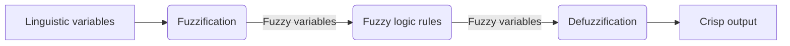

简单模糊控制器是依赖误差和误差导数的简单模糊控制器，本质上是一种非线性PD控制。简单模糊控制器由于不具有积分环节，因而很难消除稳态误差，尤其在变量分级不够多的情况下，常常在平衡点附近产生小幅振荡。为此在模糊控制器中引入积分环节，构成模糊PID控制。PID型模糊控制器的模糊规则数远大于PD型的模糊控制器，为此引入两个模糊控制器，分别实现模糊PD控制和模糊积分控制。

### 模糊PID控制

如图是利用simulink构建的**双模态PID模糊控制器**: 对I环节和PD环节的和做了进一步限幅，使得控制器输出$U$落在$[-10,10]$, 

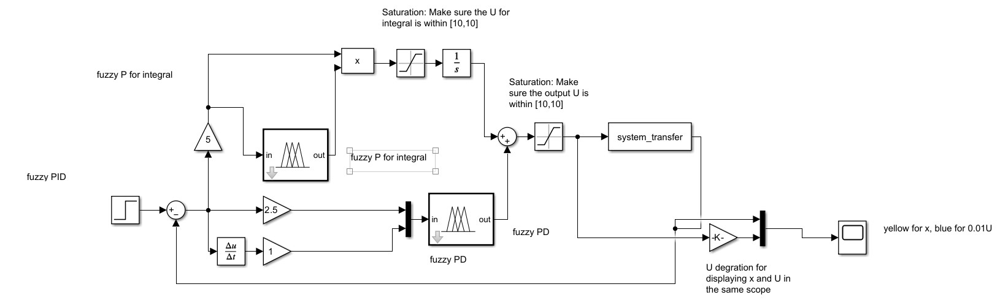

其中模糊P的比例是5，D的比例是1，I的比例是3.在上述系统中，我们对PID的输出做了限幅，这是为了保证最后系统的输出在论域范围内，从某种意义上来看，这个限幅器也是模糊控制的一部分，即根据规则将离散的规则插值为一个连续的曲面。

**PD环节**的隶属函数图及规则如下:

| 项目       | e                                                      | ec                                                      | output                                                 |
| ---------- | ------------------------------------------------------ | ------------------------------------------------------- | ------------------------------------------------------ |
| 隶属函数图 | 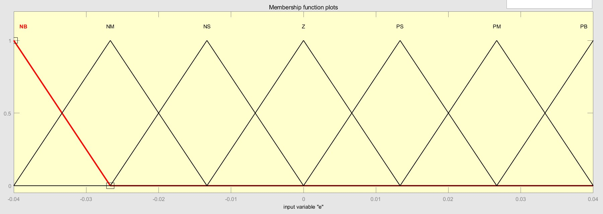 | 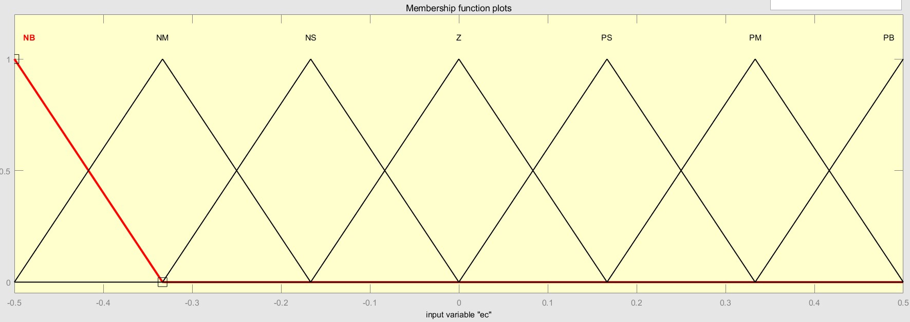 | 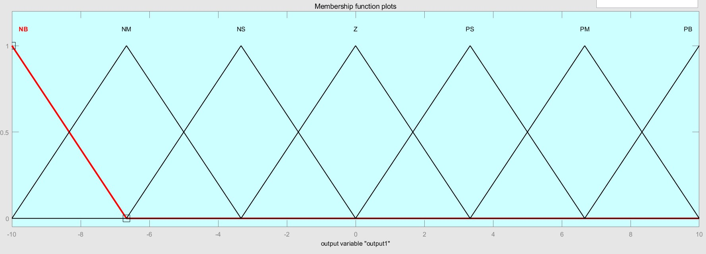 |
| 论域       | $[-0.04,0.04]$                                         | $[-0.5,0.5]$                                            | $[-10,10]$                                             |

| Rules                                                   | Surface                                                 |
| ------------------------------------------------------- | ------------------------------------------------------- |
| 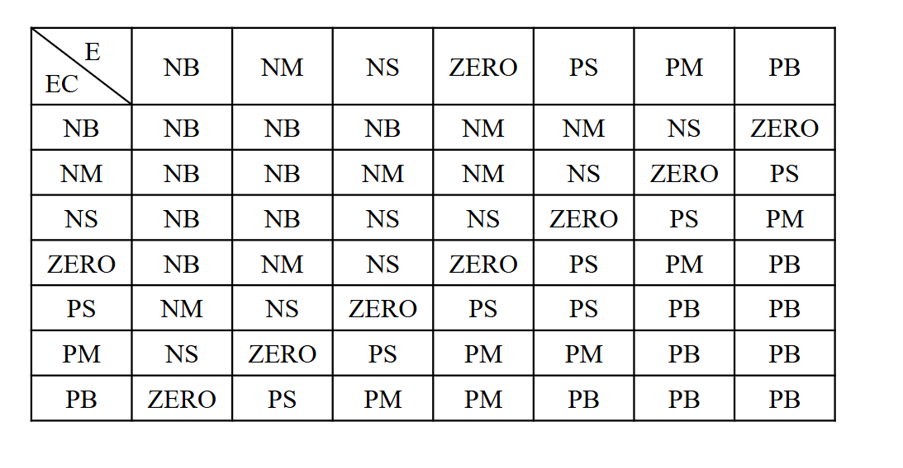 | 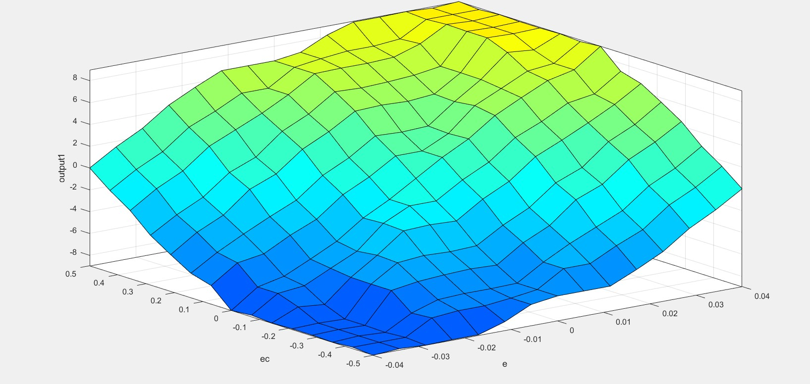 |

**I环节**的模糊P控制隶属函数及规则如下:

| 项目       | input                                                 | output                                                |
| ---------- | ----------------------------------------------------- | ----------------------------------------------------- |
| 隶属函数图 | 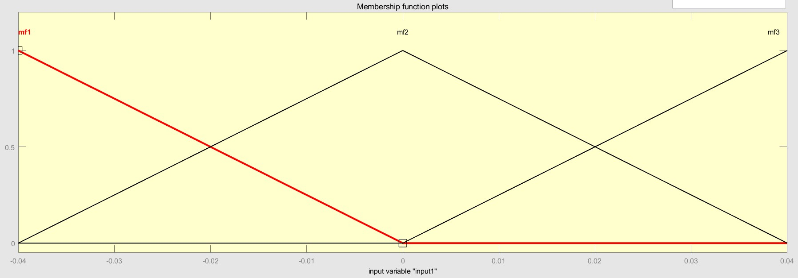 | 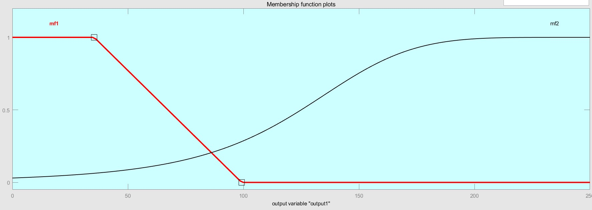 |
| 论域       | $[-0.04,0.04]$                                        | $[-10,10]$                                            |

|                         Rules                         |                        Surface                         |
| :---------------------------------------------------: | :----------------------------------------------------: |
| $rf_1，rf_3 \rightarrow rf_1,\\rf_2 \rightarrow rf_2$ | 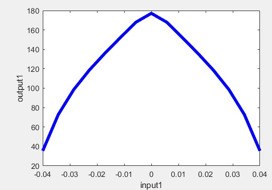 |

设置该规则的原因是特殊的PID控制器往往在接近真值时才开始积分。

**限幅器**：将I环节和PD环节的输出相加，然后做限幅，以满足输出范围为论域范围的要求

## 仿真结果

|    m |                                                       result |
| ---: | -----------------------------------------------------------: |
| 0.05 | 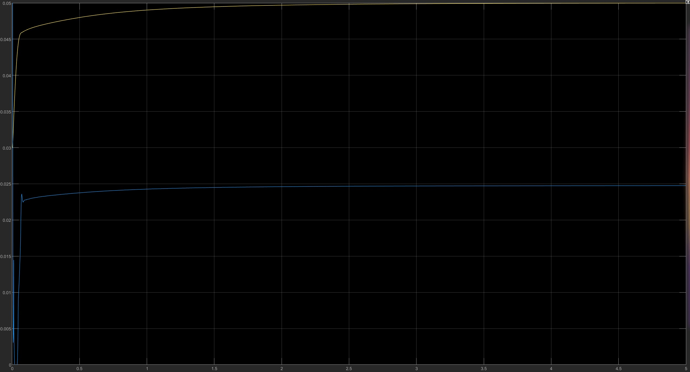 |

|    m |                                                       result |
| ---: | -----------------------------------------------------------: |
|  0.1 | 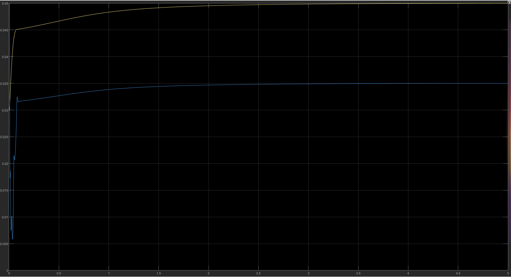 |

图中黄线为`x`,蓝线为`U/100`,可以看到两图中系统在3秒就已经收敛，没有超调，非常稳定。相比之下，m增大后系统收敛变慢，U的振荡增多，系统相对不稳定。

## 对比实验与系统参数设定

### PD控制

事实上，在使用PID控制前，我们已经尝试了PD控制，论域和PID一致，框图如下：

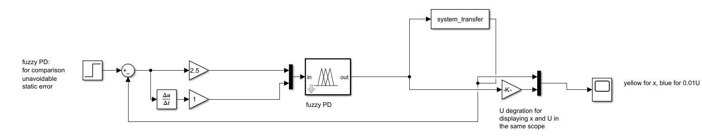

我们发现，尽管系统收敛很快，但是系统存在静差:

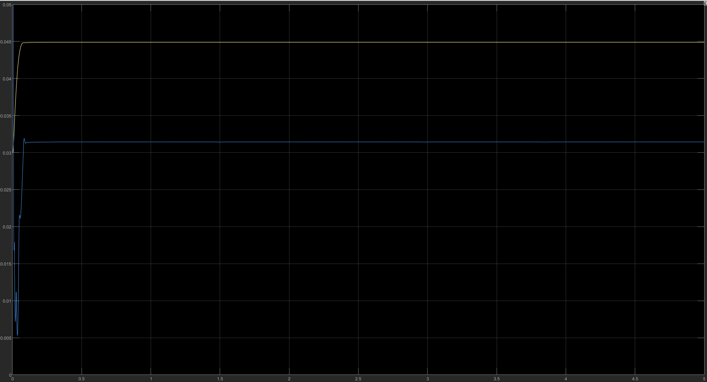

我们考虑普通PID控制，对于$K_p,K_d$, 系统的闭环传递函数为$G(s) = \frac{K_p+sK_d}{1+K_p+sK_d}$, 对于阶跃输入，有$y(\infty)=\lim \limits_{t \rightarrow \infty} = \lim \limits_{s \rightarrow 0}\frac{1}{s}sG(s)=\frac{K_p}{1+K_p}$ 显然存在静差。

我们对原系统进行分析，发现当系统误差为0时，模糊控制的输出即为确数（输入输出论域隶属函数均对称，则为0），而在静态下，若要达到目标值，模糊控制输出必须非0且为确数。

我们考虑过修改论域，但经过分析发现，==如果单纯修改论域==，则需要保证模糊控制对于0输入的输出必须是系统静态时的模糊控制系统的期望输出，如果改变期望值，则论域也需要改变，即最后==控制系统不具有可扩展性==。因此我们综合考虑，不采用修改论域的方法，只采用增加积分环节的方法。

### 模糊控制PID参数设定分析

经过实验，我们发现，系统总能在期望时间内达到稳定。给定参数似乎是较优的参数。另外我们给出调整参数后系统变得不稳定的案例。我们取`m=0.1`

**模糊控制器相当于非线性的PID**，在一定参数范围内，

| 参数 | 变化情况 | 系统收敛情况   |
| ---- | -------- | -------------- |
| P    | 增大     | 系统振荡增加   |
|      | 减小     | 系统收敛变慢   |
| D    | 增大     | 系统收敛加快   |
|      | 减小     | 系统超调明显   |
| I    | 增大     | 系统有振荡趋势 |
|      | 减小     | 系统减慢收敛   |

以下是我们分别增大减小PID的比例系数得到的结果，可以看出系统的收敛情况发生了变化，这个和线性PID控制器的性质基本相近。

| 参数 | 调整方案 | 调整结果 |
| ---- | -------- | -------- |
| P |  增大至3    | 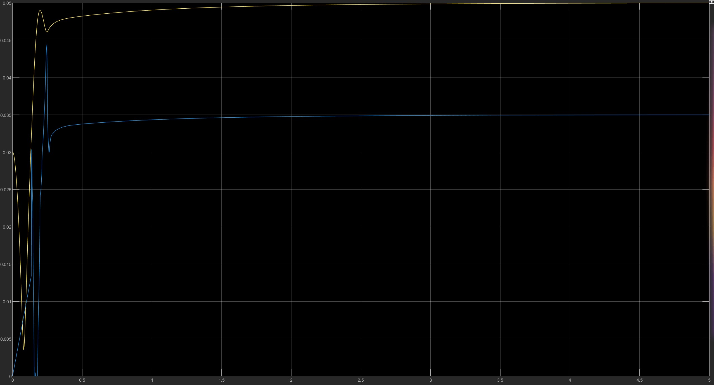 |
|      |   减小至2    | 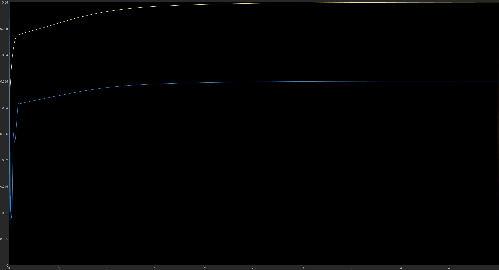 |
| D   | 增大至7  | 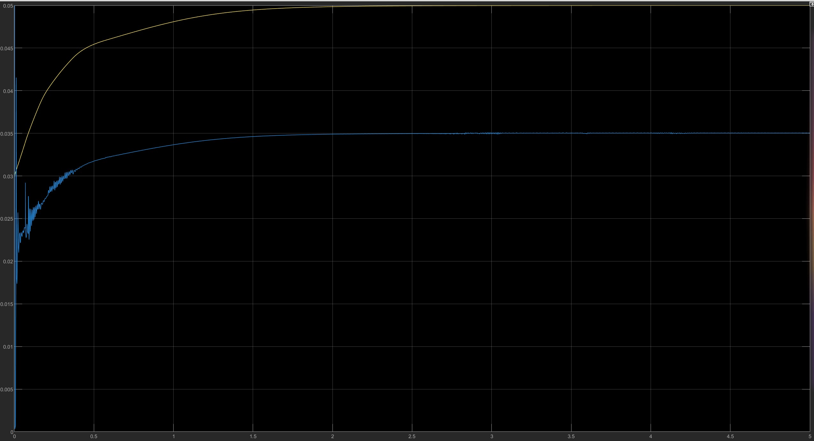 |
|      |          |          |
|      | 减小至0.5 | 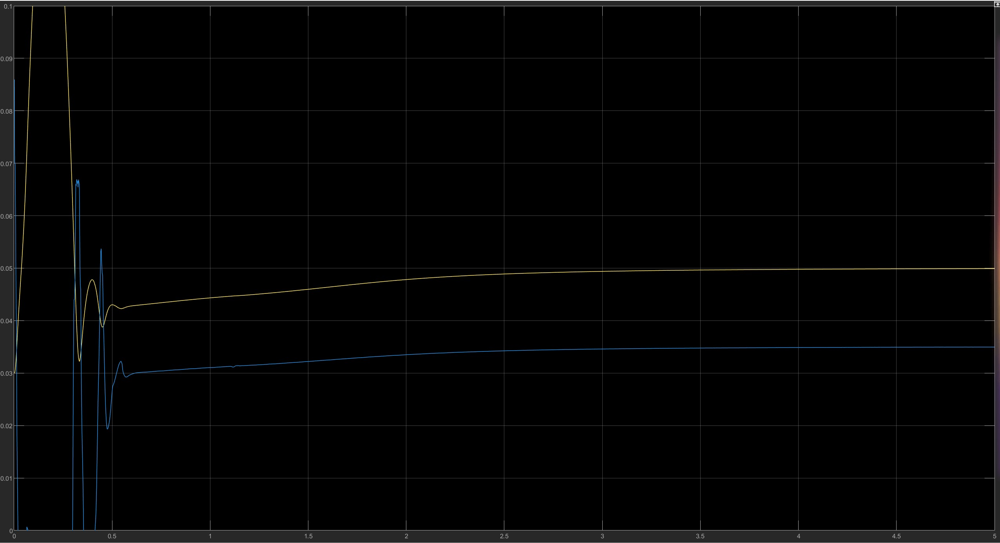 |
|  I    |    增大至10      | 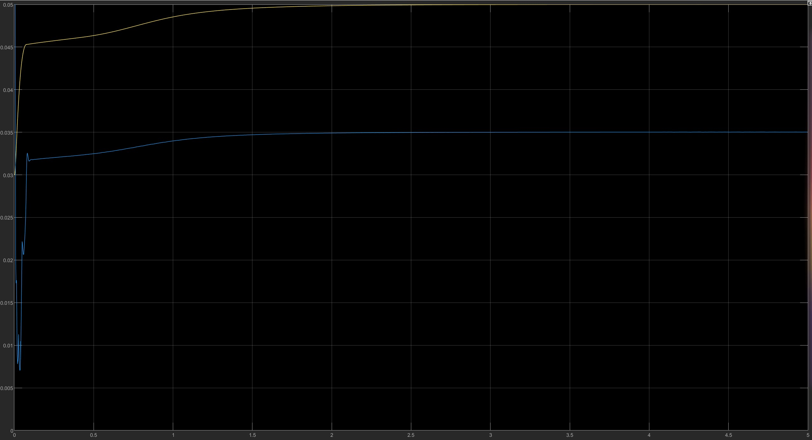 |
|      |     减小至3     | 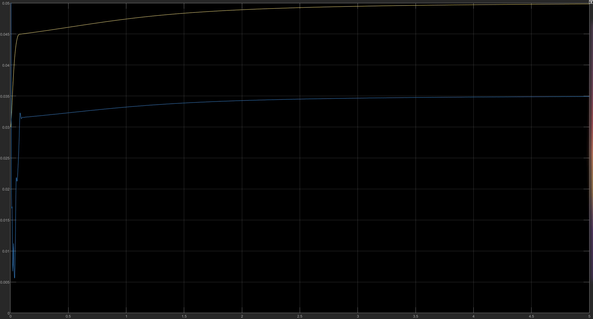 |

线性PID控制器描述如下:

> 1 比例调节作用：
> 是按比例反应系统的偏差，系统一旦出现了偏差，比例调节立即产生调节作用用以减少偏差。比例作用大，可以加快调节，减少误差，但是过大的比例，使系统的稳定性下降，甚至造成系统的不稳定。
>
> 2 积分调节作用：
> 是使系统消除稳态误差，提高无差度。因为有误差，积分调节就进行，直至无差，积分调节停止，积分调节输出一常值。积分作用的强弱取决与积分时间常数Ti，Ti越小，积分作用就越强。反之Ti大则积分作用弱，加入积分调节可使系统稳定性下降，动态响应变慢。积分作用常与另两种调节规律结合，组成PI调节器或PID调节器。
>
> 3 微分调节作用：
> 微分作用反映系统偏差信号的变化率，具有预见性，能预见偏差变化的趋势，因此能产生超前的控制作用，在偏差还没有形成之前，已被微分调节作用消除。所以可以改善系统的动态性能。在微分时间选择合适情况下，可以减少超调，减少调节时间。微分作用对噪声干扰有放大作用，因此过强的加微分调节，对系统抗干扰不利。此外，微分反应的是变化率，而当输入没有变化时，微分作用输出为零。微分作用不能单独使用，需要与另外两种调节规律相结合，组成PD或PID控制器。

根据上述表格的分析，和线性PID控制器的特性相互比较,可以发现模糊控制器的特性和线性PID控制器的基本相近,则可以按照PID调参的原则对系统进行调参,也可以参考线性PID系统的稳定性分析进行对模糊控制系统的稳定性分析.

## 总结

本实验报告展示了基于模糊控制的磁悬浮控制系统设计和效果。通过优化P、I、D参数，实现了对钢球位置的精确控制，系统表现出良好的稳定性和快速收敛性。实验结果验证了模糊控制策略的有效性，为未来控制技术的发展提供了新思路。

